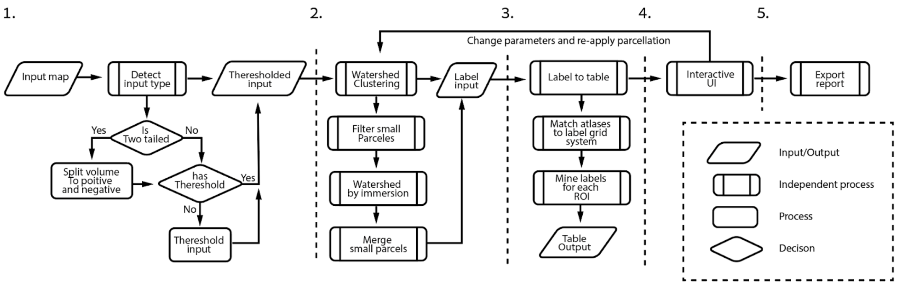
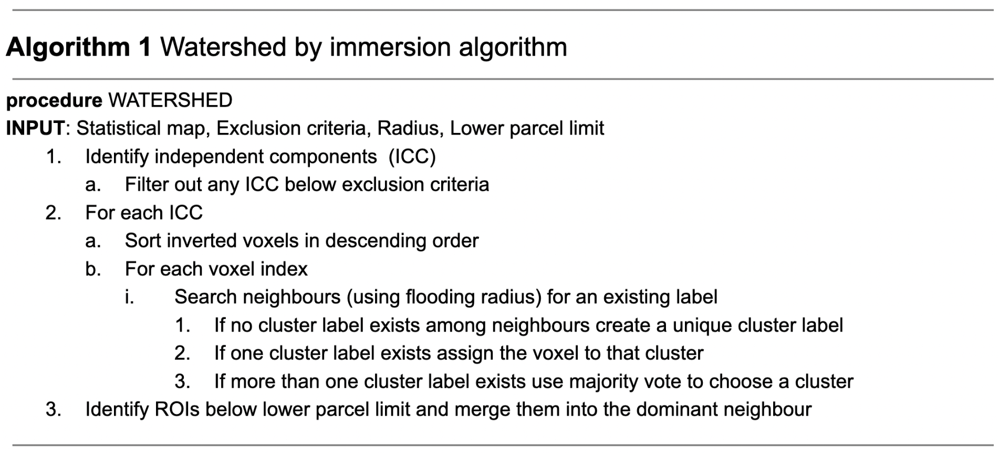

# Fusion-WS

The ***FU***nctional & ***S***tructural ***I***ntegration ***O***f ***N***euroimages (Fusion) - ***W***ater***S***hed (WS) toolbox.

The Fusion-WS toolbox provides a data-driven pipeline for creating regions of interest (ROIs) from 3D functional MRI (fMRI) task activation contrasts. At its core, Fusion-WS relies on a variant of the classic watershed by floodfill immersion algorithm<sup>1</sup> to transform smooth continuous statistical spaces into discrete ROIs. Watershed is an elegant, but naive, deterministic approach that doesn't assume spatial gaussianity or require apriori knowledge of the number of clusters/ROI (in contrast to *k*-means, for example).

The current Fusion-WS toolbox is implemented in `Matlab`.
<br>

## Matlab versions & toolboxes
Fusion-WS has been tested on Matlab 2018 & up. Fusion-WS assumes the following Matlab toolboxes are installed and in your path:
```
image_toolbox
signal_toolbox
statistics_toolbox
```
<br>

## Installation 
Download and unzip into your Matlab path. 
<br>

## DEMO - Default workflow
The default workflow is called with `fws.generate_ROI.m` and will run the watershed ROI creation using an fMRI task activation map of the multiple-demand cortex<sup>2</sup>. An interactive GUI will be generated to visualise the input map alongside a 3D render of the ROIs and some basic summaries of the ROI volume and peak voxel magnitudes. The demo can be simply called by:

```
fws.generate_ROI("demo")
```
<br>


# Using your own data
Simply provide a valid pathname to a `.nii` or `.nii.gz` file to the `fws.generate_ROI.m` function:
```
fws.generate_ROI("path/to/my_fMRI_activation_map.nii")
```
<br>

## Fusion-WS parameters
There are 3 key parameters that influence each stage of the Fusion-WS clustering referred to as `Filter`, `Radius` and `Merge`.

<br>1. `Filter` is applied after the input data is transformed into independent connected components. Components beneath the 'Filter' volume threshold are discarded.
<br>2. `Radius` is the floodfill radius of the watershed algorithm deployed duriung the initial ROIs definition (applied to each connected component). A larger 'Radius' will typically generate a smaller ROI set of ROIs with larger volumes. 
<br>3. `Merge` determines whether neighbouring ROIs below the 'merge' volume are merged. A larger 'merge' will discourage smaller ROIs in the final ROI set.  

<br>These parameters can be altered, e.g.: 

```
fws.generate_ROI("path/to/my_fMRI_activation_map.nii", "filter", 300, "radius", 1, "merge", 100)
```

## Default workflow
<br>

### 1. Preprocessing
For best results, we recommend using a 3D fMRI task-activation input map that has been registered to MNI space, statistically thresholded and/or corrected for multiple comparisons. The first stage of the default workflow checks for this and other properties. An internal IQR thresholding is applied to unthresholded input maps to retain the top 10% of voxels. 

- Detect input map type `fws.volume_kind.m`:
- Kind: Parametric or binary. 
- Tails: Does it contain positive and/or negative values.
- Threshold: Has the input map been thresholded? If not, `fws.threshold.m` is called to threshold the input map.

### 2. Watershed clustering
For parametric maps, the following procedure is applied to each tail of the input map (positive/negative values):<br>
<br>1. The thresholded input map is transformed into a connected component space using Matlab's `bwconncomp.m` function.<br>
<br>2. Each component is segmented into ROIs using the watershed algorithm. Voxel magntidues are inverted, so that peaks became cathcment basins (CB), and rank-indexed. Voxels are then handled in 1 of 3 ways as the index is iterated through until all voxels have been labelled:<br>
- *i*th voxel is assigned the proximal voxel's label if one already exists within the flooding `radius`.
- If no labeled voxel is found then the *i*th voxel is assigned a unique label. 
- A "winner-takes-all" is used to assign the *i*th voxel is multiple labels are found within the flooding `radius`.

<br>3. A final step is applied to combine neighbouring ROIs, within a component, if an ROI has a volume that is below the `merge` parameter.<br>

<br>


### 3. Anatomical labelling
The `fws.label_to_tabel.m` function is the unsung hero of the Fusion-WS toolbox. Label_to_table is an automated ROI labelling system that speeds up the process of reporting ROI characteristics. A table of labels is generated using a set of publically available atlases to assign anatomical and functional labels to each ROI. We assume that the input map has been registered to MNI space but the atlases are resampled (via `fws.interpolator.m`) to match the input map grid resolution.

### 4. ROI visualisation


## Other Fusion-WS parameters

### References
1. Meyer, F. and Beucher, S., 1990. Morphological segmentation. Journal of visual communication and image representation, 1(1), pp.21-46.
2. Fedorenko, E., Duncan, J. and Kanwisher, N., 2013. Broad domain generality in focal regions of frontal and parietal cortex. Proceedings of the National Academy of Sciences, 110(41), pp.16616-16621.
